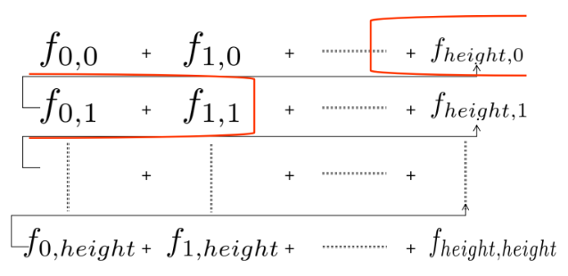

# Multithreading-TSNE

In this experiment, the TSNE high-dimensional data visualization algorithm is accelerated in parallel, and 8 functions are implemented using cuda, **which is 204 times faster**. 

During the calculation of low dimensional distribution, I encountered the problem of insufficient precision of GPU floating point numbers. Although using double can solve this problem, the calculation speed falls considerably. Therefore, double precision type calculation was used as little as possible to solve the problem.

10k MNIST data sample of its test set was used as test data.


> The above figure shows the visualization results of MNSIT training set (left) and test set (right) through tSNE. Because the dimension reduction is random, the same categories shown in the above figure are not in the same position.

## Experimental environment

|      |                         version                         |
| :--: | :-----------------------------------------------------: |
| CPU  | Intel(R) Xeon(R) Gold 6226R CPU @ 2.90GHz，2 * 64 cores |
| GPU  |                 NVIDIA GeForce RTX 3090                 |

> This experiment report uses height to represent the data volume (1w in the experiment), width to replace the original data dimension (50 in the experiment), and reducedim to represent the reduced dimension (2 in the experiment).

## MNIST

The modified NIST handwritten digit database (MNIST) contains 60000 images in the training set and 10000 patterns in the test set, each pattern is 28 in size × 28 pixels, with 256 gray levels.

Because the picture has a lot of redundant information, first I use PCA to reduce the dimension of MNIST dataset to 50, so I operate on the original data of 50 dimensions.

## TSNE

The dimensions that are most easily observed by our vision are one-dimensional, two-dimensional and three-dimensional. The graphical expression of four-dimensional and above is not so intuitive. However, the reality is to take a data set at will, which has thousands or hundreds of dimensions. For example, the classic MNIST dimension is 64, so using a two-dimensional Cartesian coordinate system is doomed to fail to draw 64 dimensions. When I want to classify high-dimensional data sets, but it is not clear whether this data set has good separability (small interval between the same kind and large interval between different kinds), I can project the data into two-dimensional or three-dimensional space through dimension reduction algorithm. Principal component analysis (PCA) dimensionality reduction method, among which other dimensionality reduction algorithms have emerged, such as multidimensional scaling (MDS), linear discriminant analysis (LDA), and isometric mapping (Isomap). In 2008, the improved SNE algorithm was t-SNE algorithm, which was widely used in the dimension reduction field.

T-SNE is a machine learning algorithm for dimensionality reduction. Different from the most commonly used linear dimensionality reduction algorithm PCA, it is a nonlinear dimensionality reduction algorithm, which is mainly suitable for dimensionality reduction of high-dimensional data to 2D or 3D for visualization. The following is a comparison of the effect of using t-SNE and PCA to visualize handwritten numerals:


However, for the following reasons, TSNE is only used for visualization, and rarely for data dimensionality reduction

- When dimension reduction is required for data, linear correlation often exists between features, and linear dimension reduction algorithm, such as PCA, is often used. For the non-linear correlation between features, I do not use the non-linear dimension reduction algorithm to reduce the dimension first and then use a linear model, but directly use the non-linear model.

- Generally speaking, I do not reduce the data dimension to 2 or 3 dimensions. The dimension reduction is generally large, such as to 20 dimensions. Because t-SNE algorithm uses t distribution with degree of freedom of 1, it is difficult to achieve good results.

- The -SNE algorithm has high computational complexity, the objective function is non convex, and it is easy to obtain the local optimal solution.

I learned about this algorithm in other courses by visualizing high-dimensional points, but this algorithm is extremely slow. It took about half an hour to calculate 1w points on the computer. Also, because the algorithm has less influence than PCA, few people studied how to accelerate it, so this project made an attempt.

### Algorithm theory

TSNE is the improvement of SNE algorithm, so to understand TSNE, we must first understand the idea of SNE algorithm.

#### SNE algorithm

SNE maps data points to probability distribution through affine transformation, mainly including two steps:

- SNE constructs a probability distribution between high-dimensional objects, so that similar objects have a higher probability of being selected, while dissimilar objects have a lower probability of being selected.
- SNE constructs the probability distribution of these points in the low dimensional space to make the two probability distributions as similar as possible.

SNE first **converts Euclidean distance into conditional probability to express the similarity between points **. Specifically, given N high-dimensional data $x_ 1,...,x_ N $, SNE first calculates probability $p_ {ij} $, proportional to the similarity between $x_ i $ and $x_j$ (this probability is self built), namely:

$$
p_{j \mid i}=\frac{\exp \left(-\left\|x_{i}-x_{j}\right\|^{2} /\left(2 \sigma_{i}^{2}\right)\right)}{\sum_{k \neq i} \exp \left(-\left\|x_{i}-x_{k}\right\|^{2} /\left(2 \sigma_{i}^{2}\right)\right)}
$$

> Set $p_ {x|x} $=0, because we focus on the similarity between two pairs.

One of the parameters here is $\sigma_{i}$. For different points, the value of $x_i$ is different, and the entropy of $P_i$ will change with σ I increase. SNE uses the concept of degree of confusion to find the best $\sigma$。 The degree of confusion refers to:
$$
\begin{gathered}
\operatorname{Perp}\left(P_{i}\right)=2^{H\left(P_{i}\right)} \\
H\left(P_{i}\right)=-\sum_{j} p_{j \mid i} \log _{2} p_{j \mid i}
\end{gathered}
$$
The degree of confusion can be explained as the number of effective nearest neighbors near a point **SNE is relatively robust to the adjustment of confusion, usually between 5-50 **. After a given, use binary search to find the appropriate $\sigma$.

For $y_i$ in low dimensions, we can specify that the variance of the Gaussian distribution is $ \frac {1} { \sqrt2} $, so the similarity between them is as follows:


$$
q_{j \mid i}=\frac{\exp \left(-\left\|x_{i}-x_{j}\right\|^{2}\right)}{\sum_{k \neq i} \exp \left(-\left\|x_{i}-x_{k}\right\|^{2}\right)}
$$

> Similarly, set $q_{i|i}$=0

If the dimension reduction effect is good, and the local features remain intact, then $p_ {i∣j}$=$q_ {i|j} $, so we optimize the distance KL divergence between two distributions, so the objective function is as follows:
$$
C=\sum_{i} K L\left(P_{i} \| Q_{i}\right)=\sum_{i} \sum_{j} p_{j \mid i} \log \frac{p_{j \mid i}}{q_{j \mid i}}
$$
After the given point $x_i$, Pi here represents conditional probability distribution of all other data points . It should be noted that **KL divergence is asymmetric **, and the penalty weights corresponding to different distances in low dimensional mapping are different. Specifically, two points that are far away from each other will produce greater costs if they are used to express two points that are close to each other. On the contrary, two points that are close to each other w ill produce less costs if they are used to express two points that are far away (note: similar to regression, it is easy to be affected by outliers, but the effect is opposite). Use the smaller $q_ {j|i}=0.2$ to model a large $p_ {j|i}=0.8, cost=p \times log ( \frac {p} {q})=1.11 $, also use the larger $q_ {j|i} =0.8$ to model a large $p_ {j|i}=0.2, cost=-0.277 $, so **SNE tends to retain local features in the data **.

#### TSNE algorithm

Although SNE provides a good visualization method, it is difficult to optimize, and there is a "crowding problem". Later, Hinton et al. proposed the t-SNE method. Different from SNE, mainly as follows:

- Simplify gradient formula using symmetric SNE.
- In low dimensional space, t distribution is used instead of Gaussian distribution to express the similarity between two points.

In high dimensions, TSNE uses symmetric P, that is:
$$
p_{i j}=\frac{p_{i \mid j}+p_{j \mid i}}{2}
$$
T-SNE uses a heavier long tailed t-distribution in low dimensional space to avoid crowding problems and optimization problems.
$$
q_{i j}=\frac{\left(1+\left\|y_{i}-y_{j}\right\|^{2}\right)^{-1}}{\sum_{k \neq l}\left(1+\left\|y_{i}-y_{j}\right\|^{2}\right)^{-1}}
$$
In addition, the t distribution is the superposition of an infinite number of Gaussian distributions, which is not exponential in calculation and will be much more convenient. The gradient of optimization is as follows:
$$
\frac{\delta C}{\delta y_{i}}=4 \sum_{j}\left(p_{i j}-q_{i j}\right)\left(y_{i}-y_{j}\right)\left(1+\left\|y_{i}-y_{j}\right\|^{2}\right)^{-1}
$$


The effectiveness of t-sne can also be seen from the above figure: 

the horizontal axis represents distance, and the vertical axis represents similarity. It can be seen that for points with large similarity, the distance of t distribution in low dimensional space needs to be slightly smaller; For points with low similarity, the distance of t distribution in low dimensional space needs to be farther. This just meets our needs, that is, the points within the same cluster (closer) converge more closely, and the points between different clusters (farther) are more distant.

To sum up, the gradient update of t-SNE has two advantages:

- For dissimilar points, a smaller distance will produce a larger gradient to repel them.
- This exclusion will not be infinite (the denominator in the gradient), so as to avoid the distance between dissimilar points being too far.

### Parallel optimization point of TSNE

Through the introduction of the algorithm, we can see that the program has the following optimization points, and we also use code to implement and verify the feasibility later:

- When calculating high-dimensional distribution P and low-dimensional distribution Q, we need to use the distance between all points (height * height), and the distance between points is calculated separately, so it can be calculated in parallel.
- For calculating P and Q matrices (height * height), each point in the matrix can be normalized after independent calculation.
- Calculate the Gradient (height * reducedim). For each element, the partial derivative can be calculated independently.
- Updating parameters (height * reducedim) can also use the parallel Adam method to update parameters.

## Implement

### Concatenation version

The steps of the tSNE algorithm are:

- Calculate Distribution $P$

- Random initialization variable $y$

- Use Adam algorithm to optimize objective function $J$

  - Calculate Distribution $Q$

  - Calculation gradient

  - Update y

### Parallel computing distanceMatrix

> code/function/D.cu

The dimension of distanceMatrix is height * height, and the calculation formula is as follows:
$$
distanceMatrix[i][j]=\sum_{k=1}^{width}(matrix[i][k]-matrix[j][k])^2
$$
The first idea is to allocate processes according to the number of distanceMatrix elements, and allocate height * height threads. Each process is calculated according to the above formula.

The kernel function code is as follows:

```c++
__global__ void compute_distance(float* matrix, int width, int height, float* distanceMatrix)
{
	int tid = threadIdx.x + blockDim.x * blockIdx.x;
	int i = tid / height;
	int j = tid % height;
	float distance = 0.0;
	for(int k=0;k <width;k++)
	{
		float temp = matrix[i * width + k] - matrix[j * width + k];
		distance += temp * temp;
	}
	distanceMatrix[i * height + j] = distance;
}
```

> The cost of GPU and CPU transmission is not considered when calculating the program time, because these are already on the GPU during the iteration process. The specific situation will be explained in detail when integrating the functions later.

Result:

```bash
the time cost by GPU is 947436490 ns
the time cost by GPU is 1111431 ns
Arrays match.
```

The **acceleration ratio is 852 times** of the average value obtained by running for 5 times

It is obviously not efficient enough to perform the cyclic addition operation inside the process, so I also try another way to allocate tasks. Each block calculates an element, and each thread in a block calculates the square of the distance difference of a dimension, and then stores it in the shared memory. Using the fast algorithm described in the class, we can calculate the total distance under the complexity of $log_n$.

```c++
__global__ void compute_distance(float* matrix, int width, int height, float* distanceMatrix)
{
	long tid = threadIdx.x + blockDim.x * blockIdx.x;
	int i = blockIdx.x / height;
	int j = blockIdx.x % height;
    extern __shared__ float distance[];

    float tmp;
    tmp = matrix[i * width + threadIdx.x] - matrix[j * width + threadIdx.x];
    distance[threadIdx.x] = tmp * tmp;
    __syncthreads();
    for (int stride=blockDim.x/2; stride>0; stride>>=1)
    { 
    	if (threadIdx.x<stride)
    		distance[threadIdx.x] += distance[threadIdx.x+stride]; 
    		__syncthreads(); 
    }
    if(threadIdx.x == 0)
        distanceMatrix[blockIdx.x] = distance[0];
}
```

But for this problem, the width is equal to 2 only when calculating low dimensional distance, and 50 only when calculating high dimensional distance at the beginning

I also considered that the distance matrix is symmetric. If the lower triangle is directly equal to the upper triangle, we can save one memory access for each thread (access the matrix twice, and directly access the distanceMatrix symmetric elements once). However, global thread synchronization cannot be used within the kernel function to ensure that the upper triangle matrix is calculated first, or the lower triangle matrix is calculated first.

### Parallel computing Q

> code/function/Q.cu

The dimension of Q is height * height. The formula for calculating Q is as follows:
$$
q_{i j}=\frac{\left(1+distanceMatrix[i][j]\right)^{-1}}{\sum_{k \neq l}\left(1+distanceMatrix[k][l]\right)^{-1}}
$$
The numerator of q is calculated according to the distance matrix, so it is easy to think of allocating height * height processes to calculate each element in parallel. However, the difficulty is the normalization of the denominator, which requires first calculating all the numerators and then summing them. This requires two-step operation. Cuda only has intra block synchronization, and we need to synchronize all the blocks, so it can only be implemented by two kernel functions, The first kernel function calculates all the numerator values and sums them, and the second kernel function calculates the numerator divided by the denominator to get the q value.

Firstly, using global memory defines the denominator.

> Shared memory cannot be used because it must be globally visible; Read only or constant memory cannot be used when the device side needs to be modified.

```c++
__device__ float sum_all;
```

For each thread i j, judge whether it is a diagonal element, if yes, it is 0; If not, use `distance[i][j]` to calculate the molecular value `tmp` and record it in the register. Assign `tmp` to `Q [i] [j]` (here, the global memory is also written directly, because faster sharing or the life cycle of registers is consistent with that of the kernel function, so the number of kernels in the second step is not visible). Then sum each block first, and then The threads in which `threadIDX.x=0` add their result to `sum_ all` .

```c++
__global__ void compute_raw_Q(float *distanceMatrix, int width, int height, float* Q)
{
    __shared__ float sum;
    sum = 0.0;
    int tid = threadIdx.x + blockIdx.x * blockDim.x;
    int diag = (tid / height == tid % height)? 1:0;
    float tmp = 0.0;

    if(diag == 0 && tid < height * height)
    {
        tmp = 1 / (1 + distanceMatrix[tid]);
    }
    if(tid < height * height)
        Q[tid] = tmp;
    atomicAdd(&sum ,tmp);
		__syncthreads();     
    if(threadIdx.x == 0)
        atomicAdd(&sum_all ,sum);
} 
```

To synchronize all threads, we need to add `cudaDeviceSynchronize()` to the host side.

After the numerator and denominator are obtained, we can calculate the Q value. In order to prevent the value from being too small, we add a protection.

```c++
__global__ void normalize(float* Q, int width, int heigh)
{
    int tid = threadIdx.x + blockIdx.x * blockDim.x;
    if(tid < heigh * heigh)
    {
        Q[tid] /= sum_all;
        Q[tid] = Q[tid]>1e-12? Q[tid]:1e-12; //Avoid branching
    }
}
```

Result:

```bash
the time cost by CPU is 1479626130 ns
the time cost by GPU is 7745643 ns
Arrays match.
```

**The acceleration ratio is 191 times**

In this way, the sum inside the block is calculated serially, so I still use the reduction acceleration algorithm.

```c++
__global__ void compute_raw_Q(float *distanceMatrix, int width, int height, float* Q, float* sum_sequence, int cluster)
{
    extern __shared__ float tmp[];
    int tid = threadIdx.x + blockIdx.x * blockDim.x;
    int diag = (tid / height == tid % height)? 1:0;

    if(diag == 0 && tid < height * height)
        tmp[threadIdx.x] = 1 / (1 + distanceMatrix[tid]);
    else
        tmp[threadIdx.x] = 0.0;
    if(tid < height * height)
        Q[tid] = tmp[threadIdx.x];
	__syncthreads();
    if(tid < height * height)
    {
        for (int stride=blockDim.x/2; stride>0; stride>>=1)
        { 
            if (threadIdx.x<stride)
                tmp[threadIdx.x] += tmp[threadIdx.x+stride]; 
            __syncthreads(); 
        }    
    }
    if(threadIdx.x == 0)
        atomicAdd(&sum_sequence[blockIdx.x / cluster] , tmp[0]);
}
```

**However, this function has serious accuracy problems in the subsequent integration**.

Let's review the formula for calculating Q:
$$
q_{i j}=\frac{\left(1+distanceMatrix[i][j]\right)^{-1}}{\sum_{k \neq l}\left(1+distanceMatrix[k][l]\right)^{-1}}
$$
The numerator is a relatively small number. According to the statistical average of 1e-3, the dimension of our Q matrix is height * height. In the experiment, it is 1w * 1w=1e8, so the denominator is probably a number of 1e5, and the average magnitude of q value is 1e-8. 

Here we need to mention the storage principle of flow.


It can be seen that the eight digits after the decimal point have reached the precision limit of the floating point number, so the Q value is no longer accurate, and the subsequent calculation of Gradient requires the use of the Q value. Especially when calculating KL divergence, the q value is on the denominator, and q is originally a small value, so its small error has a great impact on the calculation result, so we need to calculate a more accurate Q value.

The simplest and direct way here is to use the double precision floating-point type: double.

However, the 3090GPU in the experimental environment has poor processing capacity for double precision floating-point types. If you use double to process Q, it will not only affect the function of Q, but also affect the calculation of subsequent functions because Q will also be used as the input of subsequent functions. Therefore, I still want to use double to calculate as little as possible.

After exploration of functions and many experiments, I have given the following solutions:

Use float type to calculate the sum of molecules inside the block; I divide multiple block into a cluster, and then use float to calculate and store the sum of molecules in the cluster; Set the ` sum_ all` is defined as double, and then the results of all clusters are summed again to get `sum_ all`。 Therefore, the operation of designing double is only at the last step, and only one variable of double type is defined.

Let's explain it step by step:

The first step is to calculate the sum inside the block as before. Here I do not add the result of the sum in the block directly to `sum_ all`, but using `blockIdx.x / cluster` to calculate the number of the block (where the value of the cluster is taken as a hyper parameter and needs to be adjusted). After summing the blocks, I sum each cluster.

```c++
__global__ void compute_raw_Q(float *distanceMatrix, int width, int height, float* Q, float* sum_sequence, int cluster)
{
    extern __shared__ float tmp[];
    int tid = threadIdx.x + blockIdx.x * blockDim.x;
    int diag = (tid / height == tid % height)? 1:0;

    if(diag == 0 && tid < height * height)
        tmp[threadIdx.x] = 1 / (1 + distanceMatrix[tid]);
    else
        tmp[threadIdx.x] = 0.0;
    if(tid < height * height)
        Q[tid] = tmp[threadIdx.x];
	__syncthreads();
    if(tid < height * height)
    {
        for (int stride=blockDim.x/2; stride>0; stride>>=1)
        { 
            if (threadIdx.x<stride)
                tmp[threadIdx.x] += tmp[threadIdx.x+stride]; 
            __syncthreads(); 
        }    
    }
    if(threadIdx.x == 0)
        atomicAdd(&sum_sequence[blockIdx.x / cluster] , tmp[0]);
}
```

> `sum_ sequence` is a sequence that stores the sum of each cluster. The length of this sequence is calculated on the host side according to gridsize and cluster.

Part 2 I sum all clusters, that is, `sum_ sequence` summation is a common reduction summation operation. However, it should be noted that during the last atomic addition operation, our operands are of different types. Double adds Float, while 'atomicAdd' does not support this parameter. So I checked the implementation code of `atomicAdd` function on the official website and modified it.

```c++
__device__ double atomicAdd_my(double* address, float val)
{
    unsigned long long int* address_as_ull =
                              (unsigned long long int*)address;
    unsigned long long int old = *address_as_ull, assumed;

    do {
        assumed = old;
        old = atomicCAS(address_as_ull, assumed,
                        __double_as_longlong(val +
                               __longlong_as_double(assumed)));

    // Note: uses integer comparison to avoid hang in case of NaN (since NaN != NaN)
    } while (assumed != old);

    return __longlong_as_double(old);
}
```

So our function can be implemented.

```c++
__global__ void sum_cluster(float * sum_sequence, int size)
{
    int tid = threadIdx.x + blockIdx.x * blockDim.x;
    extern __shared__ float tmp_sum[];
    if(tid < size)
        tmp_sum[threadIdx.x] = sum_sequence[tid];
    else
        tmp_sum[threadIdx.x] = 0.0;

    for (int stride=blockDim.x/2; stride>0; stride>>=1)
    { 
        if (threadIdx.x<stride)
            tmp_sum[threadIdx.x] += tmp_sum[threadIdx.x+stride]; 
        __syncthreads(); 
    }

    if(threadIdx.x == 0)
        atomicAdd_my(&sum_all , tmp_sum[0]);
}
```

There is no change in the function of numerator division and denominator.

To summary, I don't really know why I can work in this way at last. I can guess that the error of Q value mainly comes from the intermediate calculation process, not from the final calculation result. The calculation of molecules is in the order of magnitude of 1e-3, so there will be no big error, but because it is only an average value, in fact, if the points converge far, that is, the distance is large. If the calculated molecular value is small, there will be errors. I need to sum all the molecular values, and the errors will be accumulated, resulting in a `sum_all` with large errors. In this way, all Q values will be greatly affected. The double operation can indeed be more accurate, making the error smaller, but the calculation cost is huge. According to our experimental observation, I modified the original version of the code to double, which is only twice faster than the CPU execution. The calculation cost is mainly spent on double and double type atomic operations, so I divide it into clusters, Finally, the number of double type atomic operations is greatly reduced by double calculation.

I set the blocksize to 128 (because I need to open a shared memory with the same size as the blocksize, I also need to consider the number of blocks placed in SM), so the original version requires 10k * 10k / 128= 781250 double atomic operations.

My method only requires $((10k * 10k / 128) / cluster (16) / blocksize\_cluster (32) $times ≈ 1526 times, which greatly saves time.

Result:
```bash
the time cost by CPU is 1480426238 ns
the time cost by GPU is 6119680 ns
Arrays match.
```

**The parallel speedup ratio is 241 times **. Double operation is designed in the last step of the function. The function complexity of normalize is far less than that of the first two steps, but it takes 2/3 of the whole operation time.

If double is used on all of the calculation, the running result is

```bash
the time cost by CPU is 1479074586 ns
the time cost by GPU is 7488220 ns
Arrays match.
```

It is 1.22 times the speed of the above operation results, which should be related to the fact that 3090 can calculate double precision floating point numbers slower than single precision operations.

### Parallel computing gradient

> code/function/G.cu

The matrix size of gradient is height * reducedim, and the calculation formula is as follows:
$$
\frac{\delta C}{\delta y_{i}}=4 \sum_{j}\left(p_{i j}-q_{i j}\right)\left(y_{i}-y_{j}\right)\left(1+\left\|y_{i}-y_{j}\right\|^{2}\right)^{-1}
$$

> The above formula only calculates one dimension of y, but actually there are two dimensions.

At the beginning, it is also the easiest to think of, that is, to calculate the gradient for each matrix element (allocate height * reducedim threads), but each thread needs to loop the height (10k) internally, and the cost is unacceptable, so I allocate height * height threads, and each thread loops the reducedim. The task of thread ij is to calculate the contribution value of the jth data point to the gradient of the reducedim elements in the i-th line of gradient.


As shown above, $f_ {i, j}$ corresponds to i and j in the above calculation gradient formula, which can be understood as the contribution value of the jth data point to the gradient in the i-th line. The red box marks the first organization form above, and the blue ellipse marks the second thread allocation method, which will obviously increase the parallelism rate.

For the above calculation, an important flaw is this atomic operation. Multiple threads may need to modify the value of `gradient [i * reducedDim+k]` at the same time (that is, the ith line and the jth dimension of gradient).


As shown in the figure, two blue circle threads may operate $ \frac { \delta C} { \delta y_ {height}} $ at the same time, resulting in a slower running speed. Moreover, it is an atomic operation of 10k threads, which costs a lot.

So I came up with the method of using shared memory for reduction.

However, the task requires reduction of each line. Because threads are organized in one dimension, a block may contain threads of different lines, as shown in red brackets below.



It is meaningless to reduce the internal pairs of such blocks, so we need to reorganize the threads, as shown in the red box below. The blue part is our redundant part, and these threads do not perform meaningful calculations.

The host side grid block division code is as follows:

```c++
dim3 blocksize(64);
dim3 gridsize(divup(height * divup(height, blocksize.x) * blocksize.x, blocksize.x));
```


In this way, we can use the shared memory reduction inside the block to speed up the sum because the gradient matrix element position of each internal operation of the block is the same.

The logic of each thread is to first calculate the f to be calculated according to the tid (note that the span calculation is used instead of the height. The lines organized by threads are different from those organized by tasks, and the lines organized by threads will be longer).

```c++
__global__ void computegradient(float *P, float *Q, float *Y, float *distanceMatrix, int height, float *gradient, int reducedDim, int scale, int span)
{
    int tid = threadIdx.x + blockIdx.x * blockDim.x;
    int i = tid / span;
    int j = tid % span;
    extern __shared__ float gradient_buffer[][2];
    if(j < height && i < height)
    {
        float Pij = P[i * height + j] * scale;
        float Qij = Q[i * height + j];
        float temp = 1 + distanceMatrix[i * height + j];
        float Yik = Y[i * reducedDim];
        float Yjk = Y[j * reducedDim];
        gradient_buffer[threadIdx.x][0] = 4 * (Pij - Qij) * (Yik - Yjk) / temp;
        Yik = Y[i * reducedDim + 1];
        Yjk = Y[j * reducedDim + 1];
        gradient_buffer[threadIdx.x][1] = 4 * (Pij - Qij) * (Yik - Yjk) / temp;
    }
    else
    {
        gradient_buffer[threadIdx.x][0] = 0;
        gradient_buffer[threadIdx.x][1] = 0;
    }
    __syncthreads();
    for (int stride=blockDim.x/2; stride>0; stride>>=1)
    { 
        if (threadIdx.x<stride)
        {
            gradient_buffer[threadIdx.x][0] += gradient_buffer[threadIdx.x+stride][0];
            gradient_buffer[threadIdx.x][1] += gradient_buffer[threadIdx.x+stride][1]; 
        }
        __syncthreads(); 
    }

    if(threadIdx.x == 0)
    {
        atomicAdd(&gradient[i * reducedDim], gradient_buffer[0][0]);
        atomicAdd(&gradient[i * reducedDim + 1], gradient_buffer[0][1]);
    }
}
```

Result:

```bash
the time cost by CPU is 1504011202 ns
the time cost by GPU is 3348798 ns
Arrays match.
```

**The acceleration ratio is 449 **.

### Parallel updating

> code/function/U.cu

The update is relatively simple. It only needs to be optimized according to the gradient of each location and the strategy of the Adam optimizer.

Result:

```bash
the time cost by CPU is 303670 ns
the time cost by GPU is 19895 ns
Arrays match.
```

**The speedup ratio is 15 times **. Although the speedup ratio of the function is not high, the update operation on the GPU will save a lot of time for the CPU and GPU to transmit data.

### Parallel computing loss

> code/function/L.cu

$$
C=K L(P \| Q)=\sum_{i} \sum_{j} p_{i, j} \log \frac{p_{i j}}{q_{i j}}
$$

Organize height * height threads, and then reduce to sum.

### Parallel computing P

> code/function/P.cu

Finally, I mentioned P, which is as important as Q in the algorithm. For parallel tasks, the benefits of parallel P are minimal, and the parallel difficulty is the greatest. P is very complex, so it is not suitable for Cuda parallelism. Because its function call relationship is complex, and each step requires transmission between the GPU and the CPU, we have simply implemented it here, but the final parallel effect is not ideal, It is even lower than the CPU serial efficiency (it should not be solved well, but it is not improved due to time).

Therefore, I use OpenMp to accelerate the calculation of P, which accelerates the code by 5 times.

## Analysis

Result:

```bash
step: 10 loss: 5.74507
step: 20 loss: 5.09442
step: 30 loss: 4.25619
step: 40 loss: 3.82339
step: 50 loss: 3.65205
...
step: 500 loss: 1.72901
cost 9097528511ns
```

Compare with CPU result:

```bash
10000 串行
step: 10 loss: 4.63326
step: 20 loss: 4.55355
step: 30 loss: 4.24367
step: 40 loss: 3.92227
step: 50 loss: 3.66576
step: 60 loss: 3.33237
step: 70 loss: 3.00327
...
step: 500 loss: 1.51458
cost 1856101131966ns
```

**The total acceleration ratio is 204 times**

Next, we will analyze the running time of each function to analyze the bottleneck of performance acceleration and provide direction for further acceleration.

The following is the running time of each function in the CPU.

> 5 iterations after calculating P

```bash
compute P cost: 46,043,731,078 ns
compute low dimension distance cost: 953,412,212 ns
compute Q cost: 1,340,922,832 ns
compute gradient cost: 1,483,629,001 ns
update parameters cost: 168,232,901 ns
```

It can be seen that the time spent inside the function loop is relatively uniform when the CPU is running.

Let's take a look at the running time of GPU's iterative functions.

```bash
compute P cost: 2,805,209,166 ns
compute low dimension distance cost: 1,110,512 ns
compute Q cost: 9,312,790 ns
compute gradient cost: 3,316,704 ns
update parameters cost: 13,552 ns
```

It can be seen that it takes 2/3 of the time to calculate Q, so we should continue to improve the overall program speedup ratio in the future and do more work on Q.

